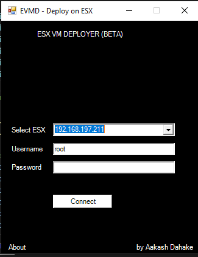
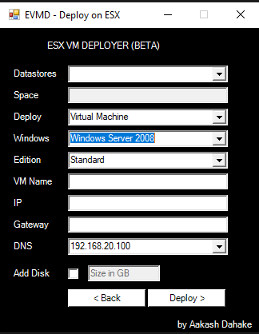

# ESX-VM-DEPLOYER

This tool is developed to deploy syspreped Windows virtual machine OVA or any custom Linux based OVA on VMware ESX hypervisor.
It needs PowerCLI to function, which can be installed from PowerShell Gallery.

--> Install-Module -Name VMware.PowerCLI -Scope CurrentUser

The GUI is developed using Windows forms, and runs on single thread so app may freeze, any suggestion to make this efficient and faster are welcomed :)

Screenshots-

